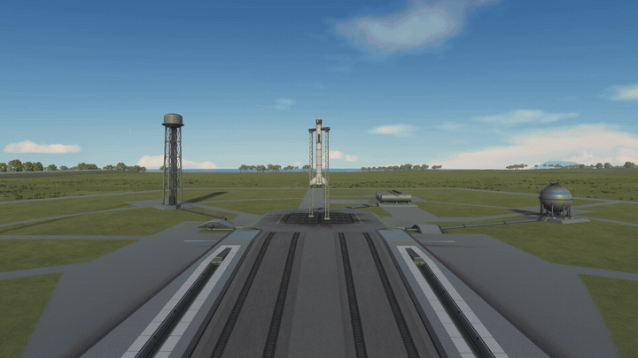
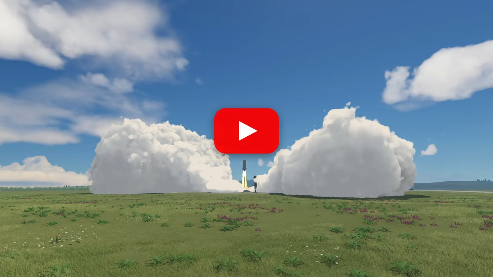
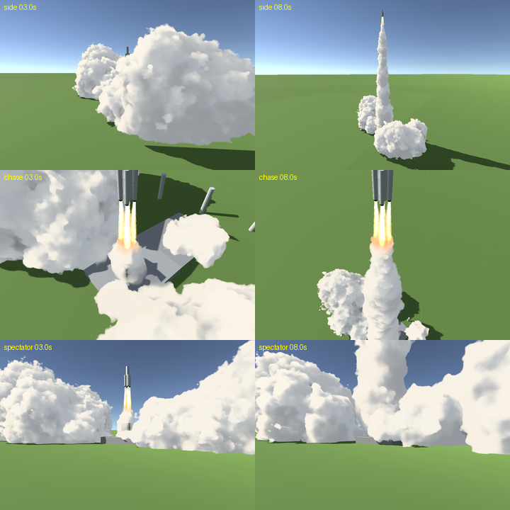

# PlumeFX

Volumetric rocket smoke for Kerbal Space Program 1.12.



PlumeFX replaces the particle smoke of solid rocket boosters with ray-marched volumetric smoke: a glowing exhaust
jet right out of the nozzle, a dense column of billowing smoke that stays in the sky for many minutes, and at the
launch pad a ground cloud that shoots out of the flame trenches and towers up beside the rocket, as in real launches
such as the Space Shuttle's.

[](https://www.youtube.com/watch?v=0EvG0IkRLH0)

*Click the image to watch a full launch on YouTube.*

## Installation

1. Install [ModuleManager](https://github.com/sarbian/ModuleManager).
2. Download `PlumeFX-x.y.z.zip` from the [releases](https://github.com/kiaulens/PlumeFX/releases).
3. Copy the `GameData/PlumeFX` folder into the `GameData` folder of your KSP installation.

## Scope and compatibility

- KSP 1.12.x on **Windows (DirectX 11)**. The shader needs shader model 5.0, and the bundle is built for Windows.
- By default only solid-fuel engines get PlumeFX smoke. On parts with a `SolidFuel` engine, a ModuleManager patch
  (`Patches/BoosterFX.cfg`) removes all stock and ReStock particle effects (flame, smoke, sparks), because PlumeFX
  draws both flame and smoke there. Sounds stay. Liquid engines keep their stock or Waterfall effects.
- Tested with stock and ReStock boosters, Scatterer, EVE, TUFX, Deferred, Parallax and Waterfall.
- If [ChuteFX](https://github.com/kiaulens/ChuteFX) is installed, both mods share the same wind.

## Features

**Exhaust jet**
- A glowing fire jet starts in the nozzle exit plane, which PlumeFX measures from the part geometry. Near the ground
  it is long and blazing; with altitude it gets shorter, and in vacuum only a short core remains.
- Right behind the nozzle the smoke is a dense, boiling fog that glows white-hot, then yellow and orange, before it
  turns into white smoke. Several boosters each get their own jet, and the jets merge into one column.

**Smoke column and trail**
- The column builds from the rocket's real path, sticks to the air, drifts with the wind, and twists over the
  minutes because the wind turns with altitude.
- A slow rocket leaves more smoke per metre, so the column is thick at liftoff. Shortly after liftoff its foot swells
  wide and fills the space between the banks of the ground cloud.
- In thin air the smoke fades out softly; above about 30 km on Kerbin only the flame is left.
- The trail stays up to 25 minutes of game time, spreads, thins out and frays, and you can still see it as a line
  from orbit.

**Ground cloud**
- While the jet hits the ground, smoke parcels shoot out with the jet's pressure. At the KSC pad they come out of the
  flame trenches as a flat, fast layer along the ground, then roll up into cauliflower towers at the head. The cloud
  grows by adding new parts, not by scaling up.
- It forms a wedge: low near the pad, with tall towers further out. One trench side gets more smoke than the other,
  at random for each launch.
- The rocket stays visible: while it is low and the boosters burn, the jet keeps a clear zone around it.
- After liftoff the cloud keeps growing for minutes, drifts with the surface wind and slowly thins out.
- KSP's own trench smoke at the pad is switched off, and the ground cloud takes its place.

**Rendering**
- The smoke is lit by the sun with self-shadowing, multiple scattering, sky light and light bounced off the ground.
  The flame glows on the smoke around it.
- The smoke casts shadows on the ground and on vessels, and terrain and buildings hide it correctly.
- Column, jets and ground cloud that overlap are drawn as one volume, so there are no sorting errors between them.

## Settings

All settings are in `GameData/PlumeFX/Settings.cfg` and are read when the game starts. Each one is commented. The
ones you are most likely to change:

| Setting | Default | Meaning |
|---------|---------|---------|
| `groundCloud` | `true` | Ground cloud at launch. `false`: the smoke only lies flat on the ground at liftoff. |
| `groundSize` | `1.0` | Size of the ground cloud. It grows with thrust anyway. |
| `groundDrift`, `windDrift` | `0.7`, `0.3` | How strongly the ground cloud and the column drift with the wind. |
| `trailLife` | `1500` | Seconds of game time the trail stays at most. |
| `fire`, `flameBoost`, `fireBoost` | `3`, `14`, `1.4` | Brightness of the exhaust and the extra length and brightness of the flame near the ground. |
| `columnCloudStyle` | `1` | Column with large connected billows like the ground cloud. `0` gives finer, more ragged billows. |
| `shadows` | `true` | The smoke casts shadows. |
| `steps`, `shadowSteps` | `64`, `4` | Ray-marching quality. |
| `maxVolumes`, `maxDistance` | `0`, `600000` | Limits on smoke sections (`0` = unlimited) and draw distance in m. |
| `srbStrength`, `keroloxStrength`, `methaloxStrength`, `hydrogenStrength` | `1`, `0`, `0`, `0` | Smoke per propellant type. Only solid fuel is tuned; the others are experimental. |
| `debugLog` | `true` | Messages tagged `[PlumeFX]` in `KSP.log`. |

## Performance

PlumeFX is a ray marcher, so it costs GPU time, mostly while a large ground cloud fills the screen. In the preview
renderer (960x640) a launch with four boosters and the cloud in view takes about 5 to 10 ms of GPU time per frame.
The CPU side stays well below 1 ms. Old, distant trail sections are recomputed only rarely, and smoke behind the
planet's horizon or very thin smoke is not drawn at all. If your frame rate drops, lower `steps` or `shadowSteps`,
or turn off `shadows`.

## Building

```powershell
./build.ps1 -KspPath "C:\Path\To\Kerbal Space Program"                 # builds GameData/PlumeFX/Plugins/PlumeFX.dll
./build.ps1 -KspPath "C:\Path\To\Kerbal Space Program" -Shaders        # ... and rebuilds the shader bundle with Unity
./build.ps1 -KspPath "C:\Path\To\Kerbal Space Program" -Deploy         # ... and copies GameData/PlumeFX into KSP
./build.ps1 -KspPath "C:\Path\To\Kerbal Space Program" -Package        # ... and creates the release zip
```

The plugin is C# 5, compiled with the .NET Framework compiler that ships with Windows. It is built from
`Source/PlumeFX.cs` (the KSP side: settings, engines, ground, wind, sun) and `Unity/Assets/PlumeFX/Core/PlumeCore.cs`
(the smoke logic, shared with the preview). The shader bundle in `GameData/PlumeFX/Shaders` is committed, so you only
need Unity **2019.4.18f1** (KSP's version) when you change the shader. Set `KSP_PATH` and `UNITY_EXE` instead of the
parameters if you like. KSP locks the DLL while it is running, so close the game before deploying.

## Offline preview

`Unity/` is a Unity 2019.4.18f1 project that simulates a launch with the real core and shader and renders stills and
videos from several cameras, which is much faster than testing in game. See [Unity/README.md](Unity/README.md).



*Offline preview renderer (plain Unity scene, no KSP lighting). In game, Scatterer and TUFX add atmosphere and bloom.*

## License

[MIT](LICENSE)
